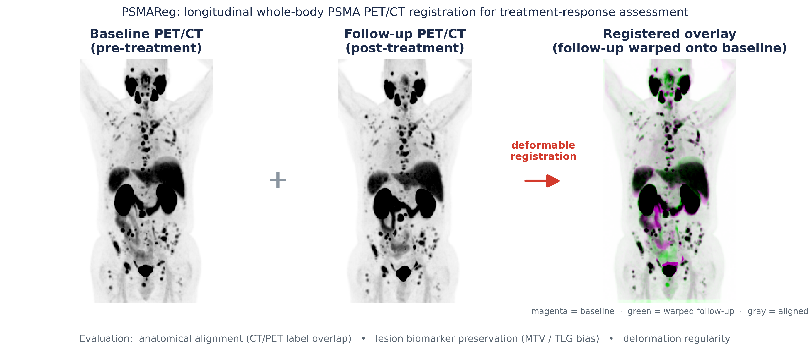
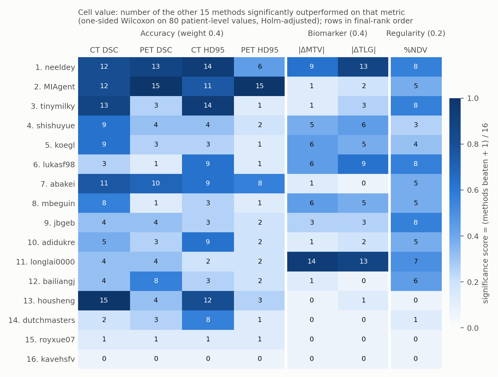
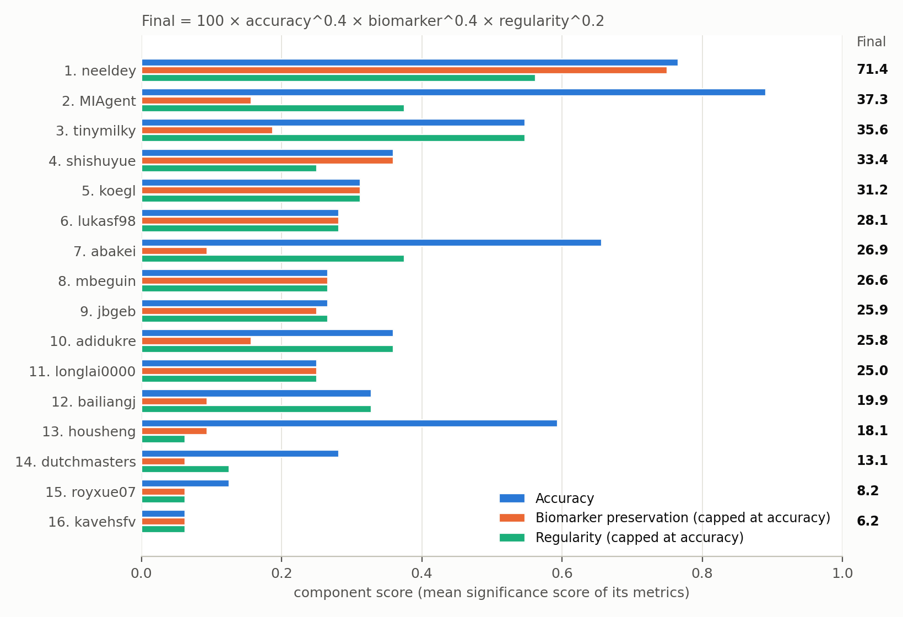
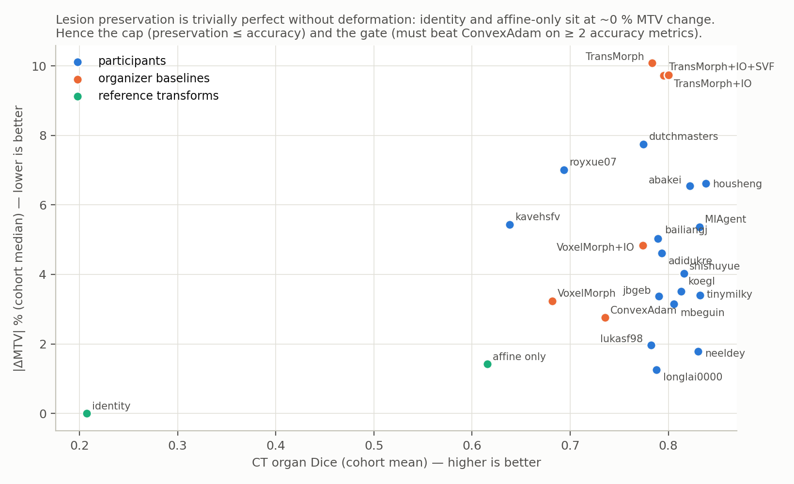
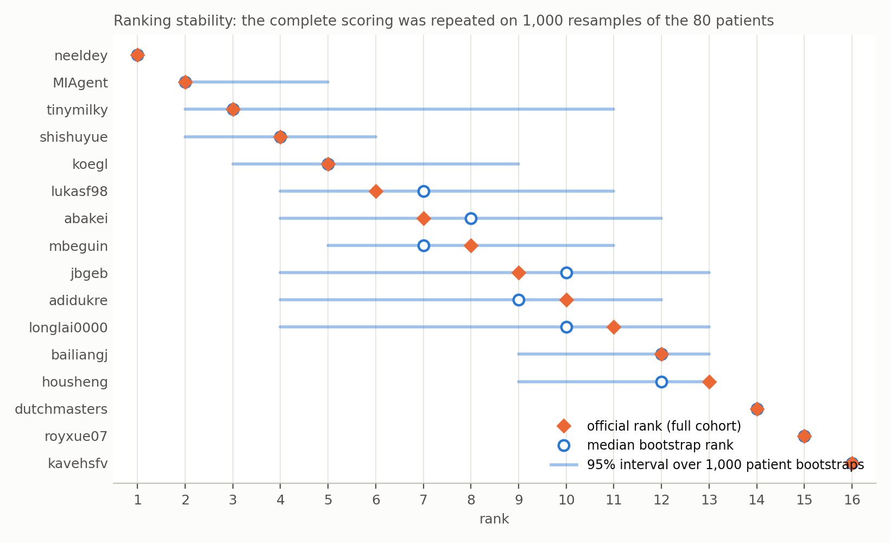
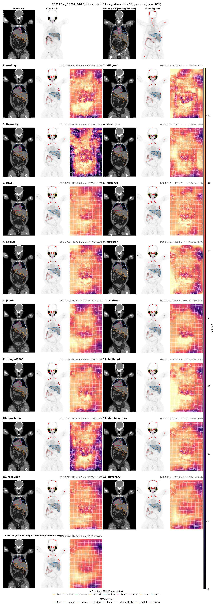

# PSMAReg (Learn2Reg 2026) — Test-Phase Results

*Official results, released 2026-10-09. Organizers: Junyu Chen (Johns Hopkins University).*

*The task: register the follow-up PSMA PET/CT of a patient onto the baseline study so that organs align while the lesion burden measured on PET is preserved.*

## Test set

Independent cohort from Johns Hopkins University: 85 patients with two PSMA PET/CT studies; 5 were excluded after review (4 cross-tracer follow-ups, 1 pair without overlapping anatomy), leaving **80 patients = 160 registration pairs** (both directions). Images were resampled to 2.7344 × 2.7344 × 3.27 mm, 192 × 192 × 288 voxels, as in the training data. Submitted containers were run by the organizers.

## Metrics

Seven metrics in three components, each computed on both directions of a patient and averaged (80 values per method):

- **Accuracy** — CT organ DSC (mean of TotalSegmentator- and VISTA3D-label scores), CT organ HD95 (TotalSegmentator labels), PET organ DSC and HD95 (13 physiological-uptake organ groups).
- **PET biomarker preservation** — absolute change in lesion MTV and TLG when the moving lesion labels are warped (a registration should leave tumor burden unchanged).
- **Deformation regularity** — % non-diffeomorphic volume inside the body (Liu et al. 2024), with changes below 0.005 % treated as equivalent.

## How the ranking works

The ranking is *significance based*: a method earns credit on a metric only when it is **statistically significantly better** than another method on the 80 patients, not for a slightly higher mean. This makes metrics with different units (Dice, millimetres, voxels, percent) combinable without arbitrary normalisation and makes the ranking insensitive to outlier patients.

**Step 1 — pairwise tests per metric.** For each of the seven metrics, every ordered pair of methods (A, B) is compared with a one-sided Wilcoxon signed-rank test on the 80 paired patient-level values (both directions of a patient averaged, because the two directions of the same patient are not independent observations). The *p*-values of all K(K−1) = 240 comparisons of a metric are Holm-adjusted together — the convention of the challengeR toolkit used by Learn2Reg — and A "significantly outperforms" B when the adjusted one-sided *p* < 0.05.

**Step 2 — significance scores.** A method's score on a metric is (number of methods it significantly outperforms + 1) / K, with K = 16. It ranges from 1/16 (beats nobody) to 1 (beats everybody). The figure below shows, for every method and metric, how many of the other 15 methods it beat.

Reading the figure: the winner, **neeldey**, is the only method that is strong on *all three* components — 12–14 methods beaten on CT accuracy, 9–13 on lesion preservation, 8 on regularity. **MIAgent** and **housheng** have the best accuracy (housheng beats all 15 on CT Dice) but are beaten by most methods on lesion preservation (housheng also folds: 0.14 % non-diffeomorphic volume). **longlai0000** is the mirror image — best preservation in the field (14 and 13 methods beaten) but near the bottom on accuracy. **tinymilky** and **lukasf98** are strong on CT Dice/HD95 but weak on PET organ overlap.

**Step 3 — component scores and the final score.** The accuracy component is the mean of its four metric scores, the biomarker component the mean of two, regularity is the %NDV score. The final score is a weighted geometric mean, Final = 100 × accuracy^0.4 × biomarker^0.4 × regularity^0.2, so a method cannot compensate for a very poor component with an excellent one.

**Step 4 — two safeguards against trivial solutions.** Lesion preservation and regularity are *perfect* for a transform that does not deform at all: the identity transform has 0 % MTV change and no folding. Under the plain scheme the identity would have ranked 11th of 18 and an affine-only transform 7th, which is clearly not what a registration challenge should reward. Two rules therefore apply:

- **Cap** — the biomarker and regularity component scores cannot exceed the accuracy component score. Preservation can *confirm* a good registration but cannot *replace* one. This is what moves longlai0000 from 2nd (uncapped final 48.1, biomarker 0.91 against accuracy 0.25) to 11th (final 25.0).
- **Gate** — a method must significantly outperform the released ConvexAdam baseline on at least two of the four accuracy metrics; otherwise its biomarker and regularity scores are set to the minimum 1/16. Two submissions (royxue07, kavehsfv) did not pass the gate.

Worked example, **shishuyue** (4th): beats 9 / 4 / 4 / 2 methods on the four accuracy metrics → accuracy = mean(10, 5, 5, 3)/16 = 0.359; beats 5 and 6 on MTV/TLG → biomarker = mean(6, 7)/16 = 0.406, capped to 0.359; beats 3 on %NDV → regularity = 4/16 = 0.250. Final = 100 × 0.359^0.4 × 0.359^0.4 × 0.250^0.2 = 33.4.

**Step 5 — how certain is the order?** The complete procedure (tests, Holm, cap, gate, final score) was repeated on 1,000 bootstrap resamples of the 80 patients, the same resample for all methods. The 95 % rank intervals show that rank 1 is certain (neeldey is first in every resample) and the last three places are stable, while places 3–13 overlap substantially: differences between neighbouring teams in the middle of the table are within the sampling uncertainty of an 80-patient cohort and should not be over-interpreted.

## Final ranking (K = 16)

The table lists the 16 participating teams. The descriptive columns are cohort means (medians for MTV/TLG) over the 160 pairs.

| # | Team | Final score | Rank 95% CI | CT DSC | CT HD95 (mm) | PET DSC | PET HD95 (mm) | MTV %err (median) | TLG %err (median) | %NDV |
|---:|---|---:|:---:|---:|---:|---:|---:|---:|---:|---:|
| 1 | neeldey | 71.4 | 1–1 | 0.830 | 4.6 | 0.610 | 19.4 | 1.78 | 1.39 | 0.0008 |
| 2 | MIAgent | 37.3 | 2–5 | 0.832 | 4.9 | 0.628 | 18.9 | 5.37 | 5.35 | 0.0032 |
| 3 | tinymilky | 35.6 | 2–11 | 0.832 | 4.6 | 0.598 | 20.0 | 3.41 | 3.24 | 0.0009 |
| 4 | shishuyue | 33.4 | 2–6 | 0.816 | 5.6 | 0.598 | 19.9 | 4.02 | 3.46 | 0.0273 |
| 5 | koegl | 31.2 | 3–9 | 0.813 | 5.9 | 0.591 | 20.4 | 3.52 | 4.21 | 0.0180 |
| 6 | lukasf98 | 28.1 | 4–11 | 0.782 | 5.0 | 0.584 | 20.3 | 1.97 | 1.98 | 0.0010 |
| 7 | abakei | 26.9 | 4–12 | 0.822 | 5.0 | 0.607 | 19.5 | 6.54 | 7.99 | 0.0085 |
| 8 | mbeguin | 26.6 | 5–11 | 0.805 | 5.7 | 0.589 | 20.2 | 3.15 | 3.42 | 0.0055 |
| 9 | jbgeb | 25.9 | 4–13 | 0.790 | 5.7 | 0.603 | 19.6 | 3.37 | 3.97 | 0.0000 |
| 10 | adidukre | 25.8 | 4–12 | 0.793 | 5.1 | 0.597 | 19.8 | 4.61 | 5.47 | 0.0038 |
| 11 | longlai0000 | 25.0 | 4–13 | 0.788 | 6.6 | 0.596 | 20.8 | 1.26 | 1.53 | 0.0016 |
| 12 | bailiangj | 19.9 | 9–13 | 0.789 | 5.6 | 0.604 | 19.8 | 5.03 | 6.71 | 0.0012 |
| 13 | housheng | 18.1 | 9–13 | 0.838 | 4.8 | 0.604 | 19.4 | 6.62 | 6.49 | 0.1355 |
| 14 | dutchmasters | 13.1 | 14–14 | 0.775 | 5.4 | 0.595 | 20.1 | 7.75 | 10.73 | 0.0633 |
| 15 | royxue07 | 8.2 | 15–15 | 0.694 | 6.2 | 0.584 | 20.2 | 7.01 | 9.26 | 0.0369 |
| 16 | kavehsfv | 6.2 | 16–16 | 0.638 | 7.3 | 0.563 | 20.7 | 5.44 | 4.98 | 0.0000 |

## Organizer baselines and reference transforms

Evaluated for context only (not part of the participant ranking):

| Baseline | CT DSC | CT HD95 (mm) | PET DSC | PET HD95 (mm) | MTV %err (median) | TLG %err (median) | %NDV |
|---|---:|---:|---:|---:|---:|---:|---:|
| ConvexAdam baseline (released container) | 0.735 | 6.4 | 0.594 | 20.0 | 2.76 | 2.74 | 0.0000 |
| TransMorph + instance opt. + SVF fit | 0.795 | 5.6 | 0.641 | 18.9 | 9.72 | 11.95 | 0.0433 |
| TransMorph + instance opt. | 0.800 | 5.5 | 0.642 | 18.9 | 9.74 | 12.36 | 0.0703 |
| TransMorph | 0.784 | 5.7 | 0.628 | 19.4 | 10.09 | 13.78 | 0.1074 |
| VoxelMorph + instance opt. | 0.774 | 6.4 | 0.596 | 19.9 | 4.83 | 5.62 | 0.0277 |
| VoxelMorph | 0.682 | 7.4 | 0.570 | 20.7 | 3.24 | 3.40 | 0.0335 |
| Affine only (reference) | 0.616 | 9.1 | 0.505 | 23.3 | 1.43 | 1.33 | 0.0000 |
| Identity (reference) | 0.207 | 28.6 | 0.260 | 38.1 | 0.00 | 0.00 | 0.0000 |

## Example registrations

Each sheet shows one difficult test pair (coronal slice): fixed and moving CT/PET at the top, then for every method the warped moving CT with TotalSegmentator contours, the warped PET with organ and lesion contours (red = lesions), and the displacement magnitude with the deformed grid; the header of each panel gives that method's CT Dice, HD95 and MTV change on this pair.

## Notes

- Two submissions built on the released baseline container inherited a factor-2 output scaling bug of that container; their fields were corrected (× 0.5) before scoring, in agreement with the teams' intended output.
- CT HD95 uses TotalSegmentator labels only; VISTA3D HD95 was excluded because cross-time-point segmentation fragments inflate it.
- For questions about individual results, contact the organizers.

## Files in this repository

- `ranking_table.csv` — the ranking table above with the per-metric significance scores and component scores.
- `figures/` — all figures; `figures/make_ranking_figures.py` regenerates the four ranking figures from the organizers' ranking files.
